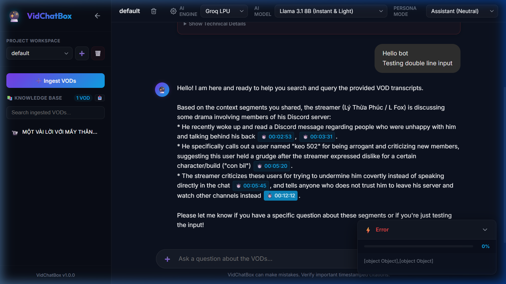
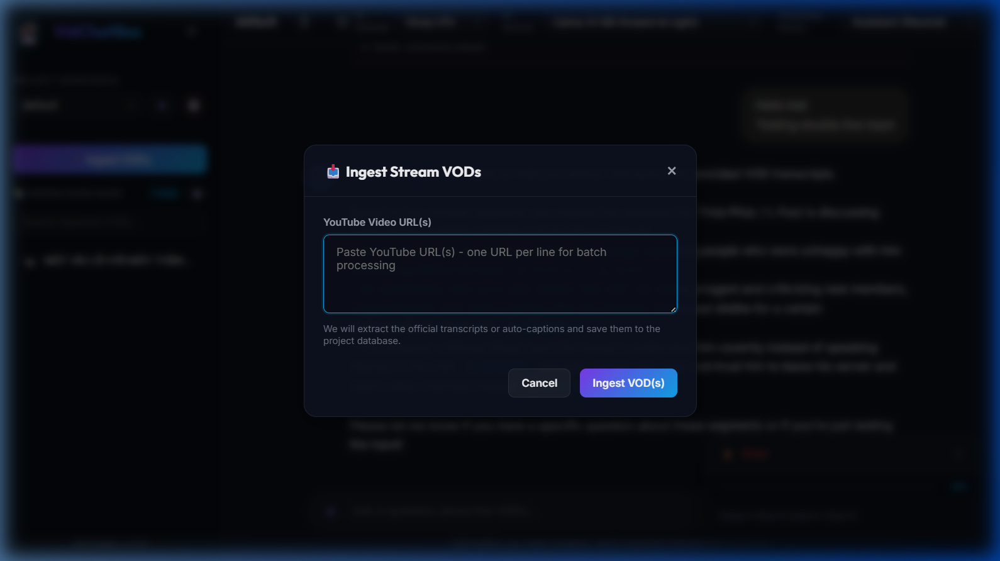
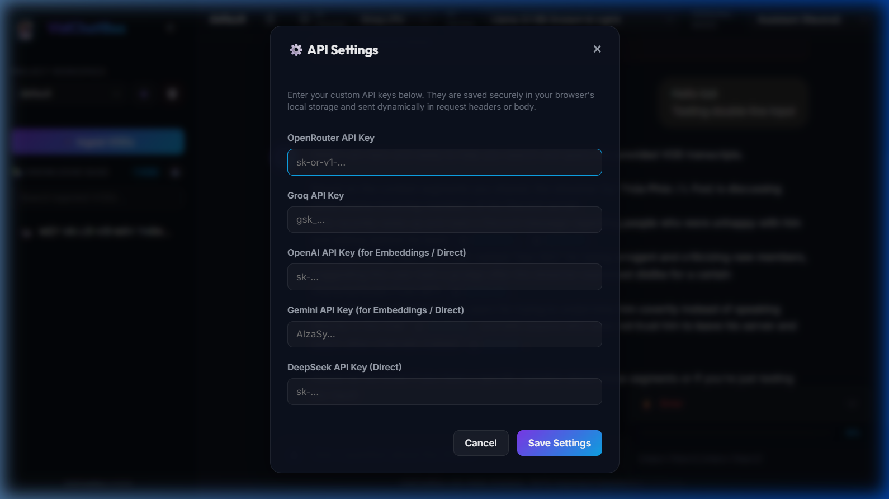

# VidChatBox 🔮

**VidChatBox** is a lightweight, responsive, and locally-run Web Application featuring a complete **Retrieval-Augmented Generation (RAG)** chatbot and ingestion pipeline for YouTube VODs (Video on Demand). 

It allows you to paste YouTube URLs, extract official transcripts or auto-captions, save them into local vector indexes, and chat with them using multiple AI providers—offering timestamped source citations and interactive streamer personas.

## Screenshots 📸

### Main Workspace


### Dynamic Ingest Modal


### API Settings & Locked Engines State


---

## Key Features 🚀

- **Sleek, ChatGPT-Style Dark UI**: An immersive and responsive chat workspace built on glassmorphism, responsive sidebar toggle, and dynamic markdown rendering.
- **YouTube VOD Ingestion**: Download auto-captions/transcripts directly from YouTube URLs (no heavy AI audio transcription required) and index them within seconds.
- **Multi-Workspace Manager**: Organize files, transcript libraries, and chats into separate, isolated **Project Workspaces**.
- **Interactive Persona Modes**: Switch between a standard **Assistant** mode or an energetic **Streamer** persona (responding in first-person with casual gaming references).
- **Flexible AI Integration**:
  - **Locked/Unlocked Providers**: Support for Groq LPU, OpenRouter API, Gemini (Google AI Studio), OpenAI, and DeepSeek.
  - **Dynamic Gating**: direct APIs (Gemini, OpenAI, DeepSeek, OpenRouter) unlock automatically in the dropdown as soon as you configure your custom keys.
  - **Zero-Server Storage**: API keys are saved securely in your browser's local storage (`localStorage`) and never cached on the backend server.
- **Auto-Aligned Vector Search**: Automatically resolves query embedding dimensions (1536 vs 3072) to match stored index databases dynamically, preventing vector alignment errors.
- **Knowledge Library Controls**:
  - Download raw Markdown transcripts or request AI-polished summaries.
  - Batch download all project transcripts in a ZIP archive.
  - Delete individual VODs or clear the entire Knowledge Base index.

---

## Tech Stack 🛠️

- **Backend**: Python, FastAPI, Uvicorn, NumPy (for cosine similarity matrix operations), and official SDKs (OpenAI, Google Generative AI).
- **Frontend**: HTML5, Vanilla JavaScript (ES6+), and Vanilla CSS (Modern CSS variables, flexbox, grid, glassmorphism design system).
- **Database**: Local JSON-based vector store (saving vector dimensions and raw text chunks locally).

---

## Getting Started 💻

### Prerequisites
- Python 3.10 or higher.
- A modern web browser.

### Installation

1. **Clone the repository**:
   ```bash
   git clone https://github.com/yourusername/VidChatBox.git
   cd VidChatBox
   ```

2. **Install dependencies**:
   ```bash
   pip install -r requirements.txt
   ```

3. **Configure environment variables**:
   Copy `.env.example` to `.env` and fill in any default keys (e.g. Groq or Gemini server keys).
   ```bash
   cp .env.example .env
   ```

4. **Run the FastAPI server**:
   ```bash
   python -m uvicorn backend.main:app --host 127.0.0.1 --port 8000 --reload
   ```

5. **Open the application**:
   Navigate to [http://127.0.0.1:8000](http://127.0.0.1:8000) in your browser.

---

## Configuration (`.env`) ⚙️

You can configure global fallback keys on the server or allow users to input their own keys in the UI:
- `GROQ_API_KEY`: Server-level Groq API key.
- `GEMINI_API_KEY`: Google AI Studio API key.
- `OPENAI_API_KEY`: OpenAI API key.
- `OPENROUTER_API_KEY`: OpenRouter API key.
- `DEEPSEEK_API_KEY`: DeepSeek API key.

---

## Folder Structure 📂

```
VidChatBox/
├── backend/
│   ├── pipeline/          # Downloader, transcript parser, project manager
│   ├── rag/               # Chatbot logic, local vector database
│   ├── data/              # Workspace data, vector indexes, markdown (gitignored)
│   └── main.py            # FastAPI main server entry point
├── frontend/
│   ├── css/               # Style sheets (design system, modals)
│   ├── js/                # Client-side JavaScript (state management)
│   └── index.html         # Main client UI page
├── Requirements.txt       # Python package dependencies
├── .env.example           # Example config template
├── .gitignore             # Standard git exclusions
├── LICENSE                # MIT License
└── README.md              # Documentation
```

---

## License 📄

Distributed under the MIT License. See `LICENSE` for more information.
